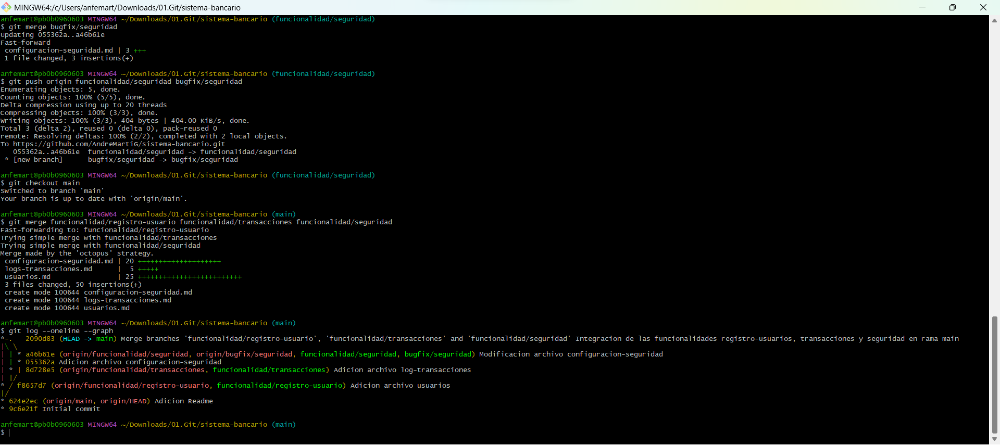

# Banco Coquito SAS

## Sistema Bancario Simulado Básico:

Este proyecto simula un sistema bancario básico. Permite a los usuarios realizar operaciones como crear cuentas, consultar saldos, depositar y retirar fondos, y transferir dinero entre cuentas.

